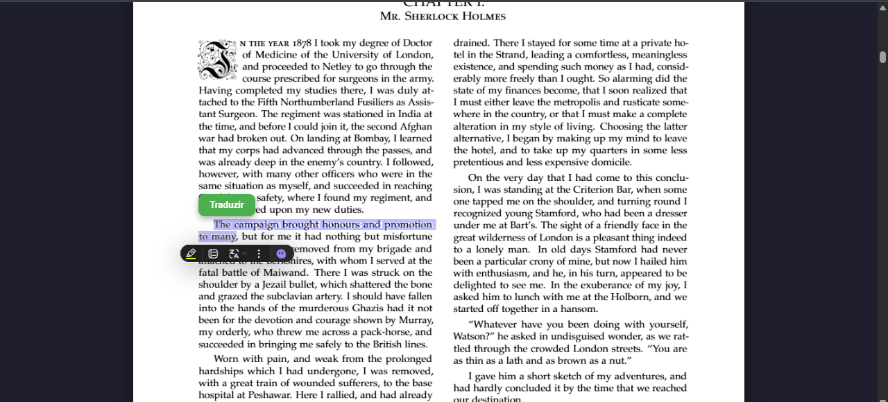
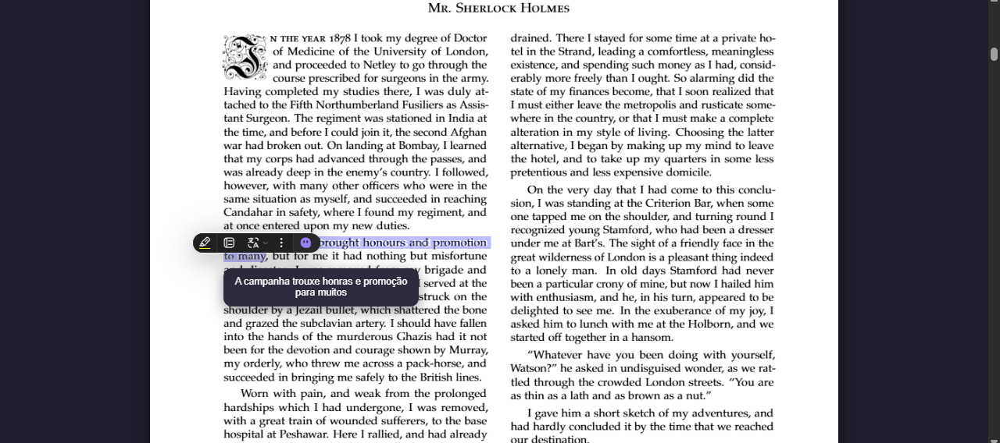

# 📖 PDFLingo

O **PDFLingo** é um leitor de PDF interativo projetado para auxiliar no aprendizado de idiomas. O projeto nasceu da observação de que muitas pessoas preferem aprender inglês através da leitura. O objetivo é facilitar esse processo, permitindo que o usuário leia livros em PDF e traduza instantaneamente palavras ou frases desconhecidas sem precisar sair do documento.

---

## 🧪 O Experimento e Motivação
Este projeto surgiu como um experimento técnico e educacional:
* **Propósito:** Auxiliar estudantes de inglês na leitura de materiais originais, eliminando a barreira de vocabulários complexos ou frases confusas.
* **Backend:** Foco total em arquitetura Spring Boot, consumo de APIs REST e manipulação de DTOs com Java Records.
* **Frontend:** Desenvolvido no estilo **"Vibe Code"** — como meu foco principal é o desenvolvimento Backend, utilizei o auxílio de IA para estruturar a interface e a lógica de manipulação da biblioteca `pdf.js`.

---

## 🚀 Como Funciona

### Fluxo da Aplicação
1. O usuário faz o upload de um arquivo PDF.
2. O sistema renderiza o PDF em um `canvas` e sobrepõe uma camada de texto (`textLayer`) para permitir a seleção.
3. Ao selecionar um termo em inglês, um botão flutuante de tradução aparece.
4. O Backend recebe o texto, consulta a API do Groq e retorna a tradução (EN -> PT-BR) em um tooltip posicionado exatamente onde o usuário está lendo.

---

## 🛠️ Tecnologias Utilizadas

### Backend
* **Java 17+**
* **Spring Boot**
* **Jackson** (Processamento de JSON)
* **Groq API** (Consumo da API externa da IA Groq)
* **Java Records** (Para DTOs leves e imutáveis)

### Frontend
* **HTML5 / CSS3** (Interface em Dark Mode)
* **JavaScript (Vanilla)**
* **PDF.js** (Biblioteca da Mozilla para renderização de PDFs no navegador)

---

## ⚠️ Limitações e Desafios
Por ser um projeto de estudo e validação de ideia, ele possui limitações conhecidas:
* **Sobreposição de Texto:** Em alguns PDFs específicos, a camada de seleção pode não se alinhar perfeitamente com as letras visíveis (as "letras ficam em cima"), o que pode dificultar a seleção exata de uma palavra.
* **Caráter Experimental:** O projeto prioriza a funcionalidade da tradução e a estrutura do backend em detrimento de uma UI/UX de nível de produção.
